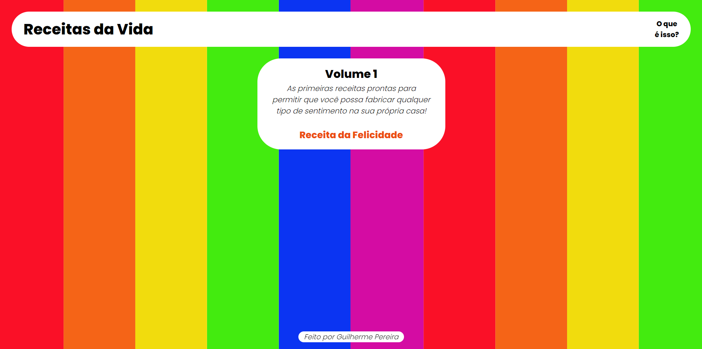

# Receitas da Vida 

>Realizo esse projeto por conta própria, utilizando duas incríveis plataformas para programadores: **Rocketseat** 🚀 e a **Alura**💻!

## 🏹 Objetivo 
Praticar o HTML, CSS e no futuro, JavaScript em uma página web.

## 🍿 O que é isso? 
Um site fictício em um universo onde sentimentos podem ser fabricados a partir de receitas alternativas. 

[🖥️ Clique aqui para acessar!]()

## 👤 Contato
guilhermep_alves@hotmail.com
